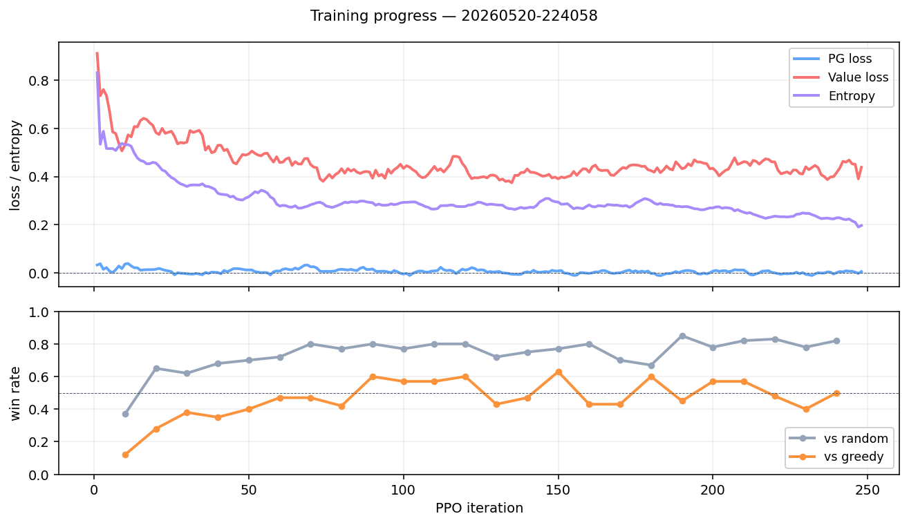
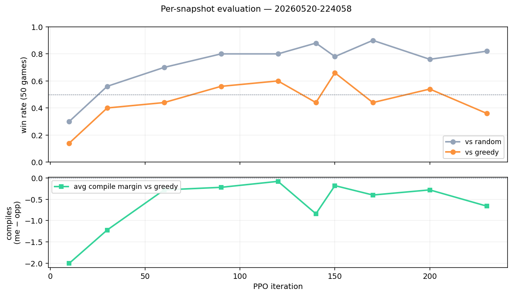
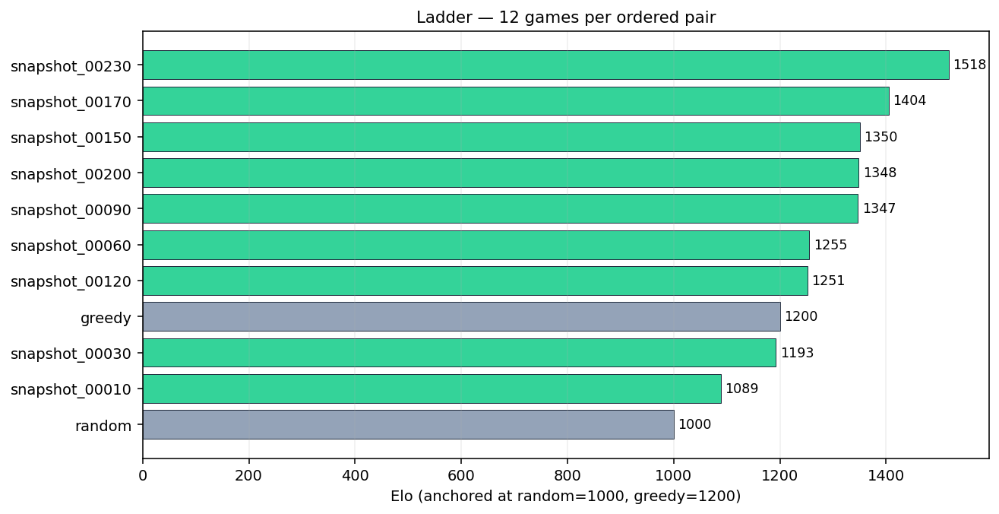

# CompileAgent

Reinforcement-learning agent that learns to play the card game
**[Compile](https://shop.greaterthangames.com/pages/compile)**, plus a
web app to play against it or record your live games for AI review.

🎮 **Live: https://webapp-pink-nine.vercel.app/**

---

The project ships three things in one repo:

1. **A faithful Compile engine** in both Python (`src/compile_engine/`) and
   TypeScript (`webapp/lib/compile/`). Generator-based effect resolution,
   180-card library across the four current sets (MN01 / AX01 / MN02 / AX02),
   official Codex errata applied. 32 tests passing.
2. **A PPO trainer** with masked-policy + value head, opponent self-play
   pool, and KL early-stopping. Trains on CPU/MPS/CUDA via PyTorch
   ([scripts/train.sh](scripts/train.sh) wraps the loop). Produces a
   shippable bot.
3. **The webapp** (Next.js 16 + Tailwind + Drizzle/Neon) — play vs the
   trained bot, transcribe live in-person games against another player for
   later AI review, browse saved games. Auth-gated; each user only sees
   their own games.

The current shipped bot is **Sparkv1** (PPO iter 120, see
[docs/model-card-sparkv1.md](docs/model-card-sparkv1.md) and the figures
below).

---

## Training progress



500-iter PPO run on 30 protocols, 180 cards. Three losses (policy
gradient, value, entropy) on the top axis; eval win-rates against the
Random and Greedy baselines on the bottom. Greedy maxes immediate line
value — a non-trivial benchmark for the agent to clear.

## Per-snapshot evaluation



Each checkpoint (every 10 iters) evaluated with the `scripts/eval/`
pipeline: 50 deterministic-argmax games vs Random + Greedy, with
seat-alternation. Top: win-rate. Bottom: average compile margin (mine
minus opponent's at game end). The plateau against Greedy at iter
120–150 is what drove the choice of Sparkv1.

## Ladder



All-pairs round-robin between 9 snapshots + the two anchors (Random at
Elo 1000, Greedy at 1200). Elo computed from 12 games per ordered pair
(24 per unordered pair). Iter 90 wins the headline Elo, but iter 120
beats it head-to-head 63/100 — see
[docs/model-card-sparkv1.md](docs/model-card-sparkv1.md) for the rationale.

---

## Features

### Play vs Sparkv1

- ONNX-exported policy network running in the browser-adjacent serverless
  layer via `onnxruntime-web`. ~80–150ms per move on Vercel.
- Real Compile rules: 180 cards, drafting, line value, compile threshold,
  control rule, recompile + steal, Codex errata. Effect chains resolve
  through a JS generator runtime that mirrors the Python engine.

### Record-mode AI review

In-person games against another human are full of imperfect information
— you don't know your opponent's hand or face-down cards. Record mode
handles this:

- Both seats' hands and decks are **placeholders** (`def_id = -1`) until
  the recorder fills them in at play time.
- For your own plays you pick the card identity from a library filtered
  to the line's protocol.
- For the opponent's face-down plays you only log the line; if an effect
  later reveals it, the engine pauses and asks you what it was.
- After recording, hit **AI eval** — the bot replays every one of your
  decisions and shows what it would have played + the value head's
  position estimate.

### Card visuals

Three discrete effect tiers (Top / Middle / Bottom) on every card, with
physical-style stack overlap on the field: the upper card covers the
lower card's header + top tier, leaving M+B visible — matching the
in-play rule that the top effect is suppressed when covered.

---

## Quick start

```bash
# Clone + Python deps
git clone https://github.com/<you>/CompileAgent.git
cd CompileAgent
python -m venv .venv && source .venv/bin/activate
pip install -e .

# Run engine tests
python -m pytest tests/ -q
```

### Train a bot from scratch

```bash
./scripts/train.sh --iters 500
# Checkpoints + metrics land in runs/<timestamp>/.
```

### Evaluate checkpoints

```bash
# Per-snapshot behavioral metrics + model card (60s each on CPU):
python scripts/eval/collect.py --model runs/<run>/snapshot_00120.pt \
  --opp greedy --games 50 --device cpu \
  --out runs/<run>/eval/snapshot_00120/vs_greedy.jsonl
python scripts/eval/metrics.py --in runs/<run>/eval/snapshot_00120/ \
  --out runs/<run>/eval/snapshot_00120/metrics.json --model snapshot_00120
python scripts/eval/card.py --metrics .../metrics.json \
  --out runs/<run>/eval/snapshot_00120/model_card.md

# All-pairs ladder between snapshots + baselines:
python scripts/eval/ladder.py --snapshots runs/<run>/snapshot_*.pt \
  --games 12 --device cpu --out runs/<run>/eval/ladder.json

# Regenerate the README figures:
python scripts/eval/plot.py --run runs/<run> --out docs/figures/
```

### Ship a trained checkpoint to the webapp

```bash
# Export to ONNX (self-contained ~2.4 MB file):
python scripts/eval/export_onnx.py \
  --ckpt runs/<run>/snapshot_00120.pt \
  --out webapp/public/models/bot-current.onnx

# Update the swap point: webapp/lib/bot-config.ts → CURRENT_BOT.

# Build + deploy:
cd webapp && vercel deploy --prod
```

### Run the webapp locally

```bash
cd webapp
cp .env.development.local.example .env.development.local
# Fill in DATABASE_URL (Neon branch), SESSION_SECRET, DEV_MODE=true.
npx drizzle-kit migrate
npm install
npm run dev
# DEV_MODE=true auto-logs you in as user "dev"; no signup needed locally.
```

---

## Architecture

```
src/compile_engine/        Python game engine, agents, PPO trainer
  cards.py                 180-card library + errata
  state.py, game.py        Game state, turn loop, phase machine
  effects.py               All card-specific effects (top/middle/bottom)
  actions.py               Action and Choice types
  env.py, agents.py        RL env + Random / Greedy baselines
  nn/                      Encoder, model, PPO loop, NN agent

webapp/lib/compile/        TS port of the engine (same shape, same tests)
webapp/lib/compile/nn-*.ts NN encoder + ONNX bot for in-browser inference
webapp/lib/auth.ts         scrypt + jose JWT session cookie auth

scripts/
  train.sh, train_nn.py    Training entry points
  eval/                    collect → metrics → card → ladder → plot pipeline
  eval/export_onnx.py      PyTorch → ONNX exporter

docs/
  model-card-sparkv1.md    Current shipped bot card
  figures/                 README plots

tests/                     32 Python tests (engine correctness + NN sanity)
```

---

## Contributing + flagging issues

- **Found a bug?** Open a GitHub issue using the
  [bug report template](.github/ISSUE_TEMPLATE/bug_report.md). Include
  the game id (visible in the URL) if it's a webapp issue, or the
  seed/iter if it's a training/engine issue — replays are deterministic
  given (seed, action list).
- **Want a feature?** Open an issue first (the
  [feature request template](.github/ISSUE_TEMPLATE/feature_request.md))
  to discuss before sending a PR.
- **Pull requests** are welcome but main is protected — the repo owner
  reviews and merges every PR. Run the test suite locally before
  pushing:
  ```bash
  python -m pytest tests/ -q              # engine + NN
  cd webapp && npm run build              # webapp typecheck + build
  ```
  See [CONTRIBUTING.md](CONTRIBUTING.md) for details.

---

## Attribution + license

- **Compile** is a card game by Greater Than Games. The card text and
  protocol names are theirs; this repo uses the community-vendored
  `data/cards.json` and applies the official Codex errata
  ([source](https://shop.greaterthangames.com/pages/compile)).
- The engine, trainer, webapp, and Sparkv1 weights are MIT-licensed; see
  [LICENSE](LICENSE).
